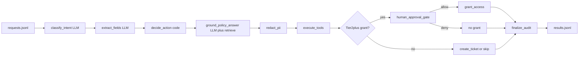

# Design note — Triage & Resolve

Mini-ADR for the take-home pipeline. Decisions over essays.

## Architecture

Straight-line stages in `process_request` (`starter/pipeline.py`): classify → extract → decide → ground (policy only) → redact → tools/gate → audit. Each request emits one machine-readable audit row in `results.jsonl`.

## Why this orchestration

- **One pipeline, fixed order.** Easy to test, debug, and cite in an audit record. Multi-agent chatter earns no bonus by itself (assignment README).
- **LLM where language is fuzzy** (intent, field extraction, policy phrasing). **Code where policy must be exact** (thresholds, tiers, refusal, PII mask).

## Where plain code beats LLM judgment

| Concern | Where | Why code |
| --- | --- | --- |
| Purchase bands (`<$500` / `≤$5k` / else) | `starter/decide.py` | Must match `knowledge/purchase_limits.md` every time |
| Access Tier ≥2 → require approval | `starter/decide.py` + gate | Hard stop before mutation |
| Data category → route/escalate | `starter/decide.py` | Policy map, not a guess |
| OOS → `reject`; injection → never `auto_resolve` | `decide.py` / finalize | Untrusted input is data |
| Citation allowlist | grounding filters to retrieved chunks | No invented doc names |
| PII mask | `starter/pii.py` | Deterministic redaction in audit + tickets |

## Approval gate

- Tier 1 grants may call `grant_access` without the gate.
- Tier ≥2 / Restricted: `requires_approval=True`; `human_approval_gate` runs **before** `grant_access`.
- **Default deny.** Allow only via explicit decisions or batch `TRIAGE_MOCK_APPROVE` (`all` / request ids). Production must stay interactive; mock is for offline runs only.
- Prompt-injection flags still block grants even if mock-approve is on.

## Tool failures (`grant_access`)

Stub fails ~15%. `try_grant_access` (`starter/tool_actions.py`): **one retry** after **50ms** backoff, then **escalate** with `grant_access_failed`. Both attempts are logged on the audit record. Chosen over infinite retry (latency/cost) or silent fail (unsafe).

## Cost / latency (pipeline run 2026-09-05)

| Metric | Value |
| --- | --- |
| Requests | 40 |
| Total estimated cost | ~$0.011 |
| Avg cost / request | ~$0.000274 |
| Mean latency | ~3.3 s |
| Tokens (sum) | ~63k |

Eval means: see `reports/eval_report.md` (~3.3 s; printed `avg_cost_usd` rounds to `0.000` at 3 dp).

### Cutting API cost ~50% without tanking quality

1. **Cheaper / smaller model for classify + extract** (easy cases); keep a stronger model only for ambiguous or policy grounding.
2. **Skip retrieve + ground** when intent ≠ `policy_question` (already mostly true — keep it strict).
3. **Cache** embedding index (done under `.scratch/`) and repeated policy-question answers.
4. **Batch / lower-priced routing** for offline corpus runs when latency can wait.

## Deliberately not built / +2 days

**Skipped:** multi-agent orchestration; interactive approval UI; zero-spend LLM mock for CI; hybrid/RRF retrieval; enablement walkthrough video.

**With 2 more days:** align Tier 2/3 final `action` vs `evals/labels.json` (post-approve `auto_resolve` vs gold `escalate`) without removing the gate; block `grant_access` when `lookup_user` is missing; short enablement note (add intent / tool / eval case); print cost with more decimals in the eval table.
